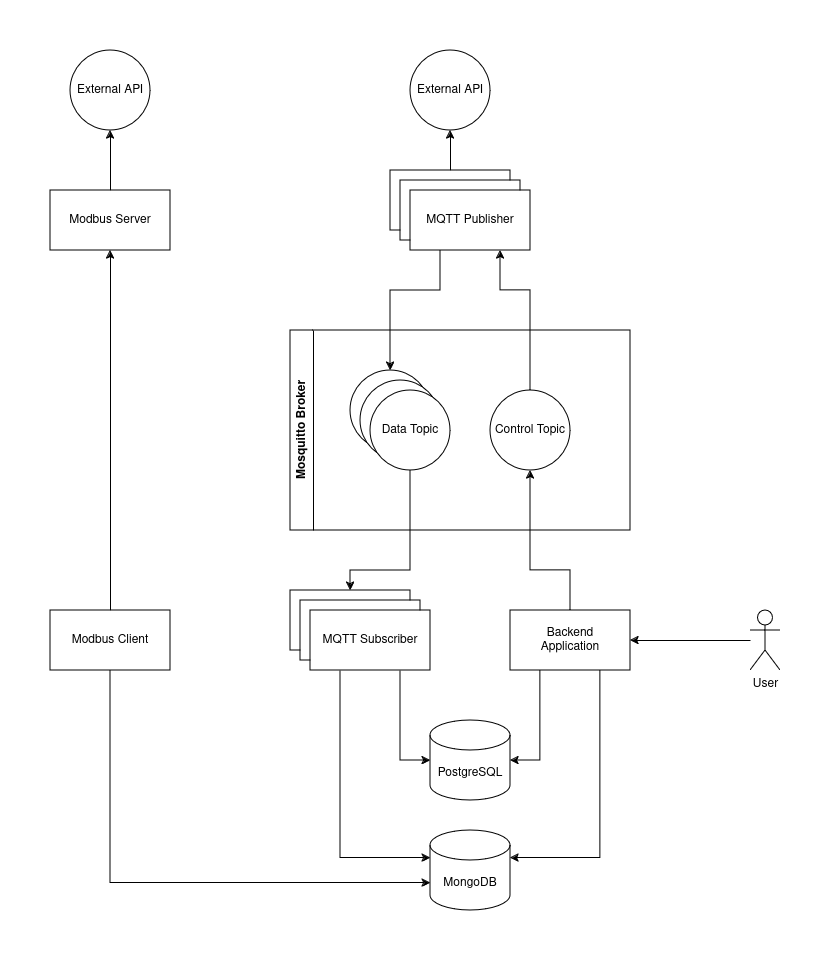

# Assignment for an interview at EASYCON Solution s.r.o.

This project is a solution to an assignment, created specifically for job interview at EASYCON Solution s.r.o. It will
be removed shortly after the interview.

## Description

The system consists of five components:

- A backend application for data visualization and control of some part of the system.
- An MQTT publisher for publishing data to MQTT topics.
- An MQTT subscriber for reading MQTT topics and storing data in databases.
- A Modbus server for writing data to input registers.
- A Modbus client for reading data from input registers and storing them in database.

The system is visualized in the following image.



The MQTT publisher reads data from a public API and publishes its content to an MQTT topic. The subscriber listens for
messages on that topic, storing received messages in a MongoDB database and some message metadata in a PostgreSQL
database.

There can generally be any number of publishers and subscribers, as long as the message broker and subscribers are not
overloaded. The system does not implement any protection against overload.

The Modbus server reads weather data from the public API and stores it in its registers. The client periodically reads
the registers and stores their content in MongoDB.

The user can view all stored data and metadata and control individual MQTT publishers by stopping or starting them as
needed.

## Installation

All components of the project can be installed and run from the root directory. The use of virtual environment is
recommended. Their dependencies overlap, so one virtual environment should be enough.

Or alternatively, each component can be operated from its own directory and treated as a standalone project.

```bash
pip install -e backend_app/ \
&& pip install -e mqtt_publisher/ \
&& pip install -e mqtt_subscriber/ \
&& pip install -e modbus_client/ \
&& pip install -e modbus_server/
```

## Running

### Certificates

The MQTT connection may be protected by SSL/TLS. To create a self-signed certificate for testing the project, use:

```bash
openssl req -x509 -newkey rsa:2048 -keyout mosquitto/certs/mosquitto_key.pem \
-out mosquitto/certs/mosquitto_cert.pem -days 365 -nodes \
-subj "/C=CZ/ST=State/L=City/O=Organization/OU=Unit/CN=localhost"
```

### Environment setup

In order to run the project, you need to have running instances of:

- MongoDB 8.0
- PostgreSQL 17
- Eclipse Mosquitto 2.0

You can set up the environment with the docker-compose:

```bash
docker-compose up -d
```

To stop and remove the environment, use:

```bash
docker-compose down
```

### Running the system components

The following examples assume the components are run from the project's root directory.

#### Backend application

The backend application visualizes data and controls the MQTT publisher, which collects data for the system. To see all
available endpoints, refer to the [openapi.yaml](docs/openapi.yaml).

To start the development server for the backend application:

```bash
python backend_app/src/backend/manage.py runserver
```

#### MQTT publisher

The publisher collects data from a public web API and publishes it to an MQTT topic. The API and topic can be configured
in the configuration file (see the [example](config/mqtt_publisher_config.json)).

To run the publisher, use:

```bash
mqtt_publisher --id "publisher-1" --config config/mqtt_publisher_config.json
```

The `--id` argument identifies the publisher and allows the backend application to control it.

#### MQTT subscriber

The subscriber listens for messages on a specified topic and records them to MongoDB and PostgreSQL databases.
The topic and storage configurations can be adjusted (see the [example](config/mqtt_subscriber_config.json)).

To run the subscriber, use:

```bash
mqtt_subscriber --id "subscriber-1" --config config/mqtt_subscriber_config.json
```

The `--id` argument informational only; the backend application cannot control subscribers.

#### Modbus server

The Modbus server component reads weather data from the [Open-Meteo](https://open-meteo.com/) API and writes the to the
input register. The URL can be adjusted in the configuration file (see the [example](config/modbus_server_config.json)).

To run the Modbus server, use:

```bash
modbus_server --config config/modbus_server_config.json
```

#### Modbus client

The Modbus client component reads the weather data from the server's input register and stores it in MongoDB.
Connections to the server and storage can be specified in the configuration file (see
the [example](config/modbus_client_config.json)).

To run the Modbus client, use:

```bash
modbus_client --config config/modbus_client_config.json
```

## Testing

Currently, only backend application is covered by simple tests. To run them, use:

```bash
cd backend_app
python src/backend/manage.py test
```